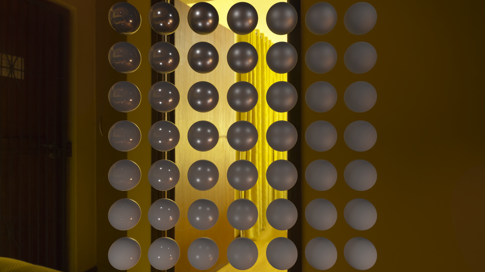
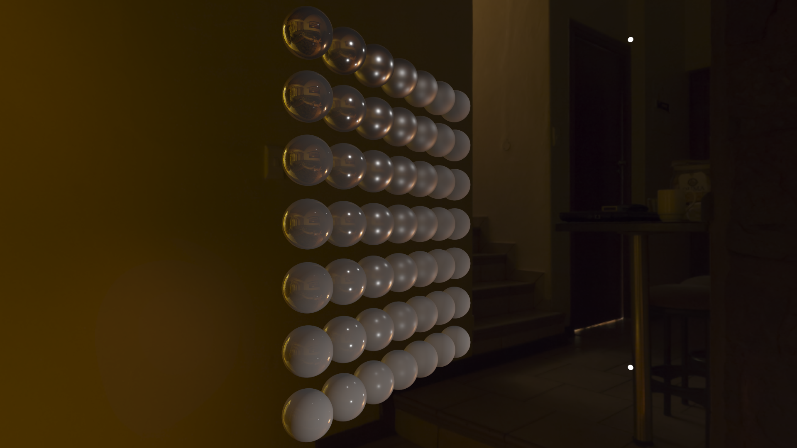
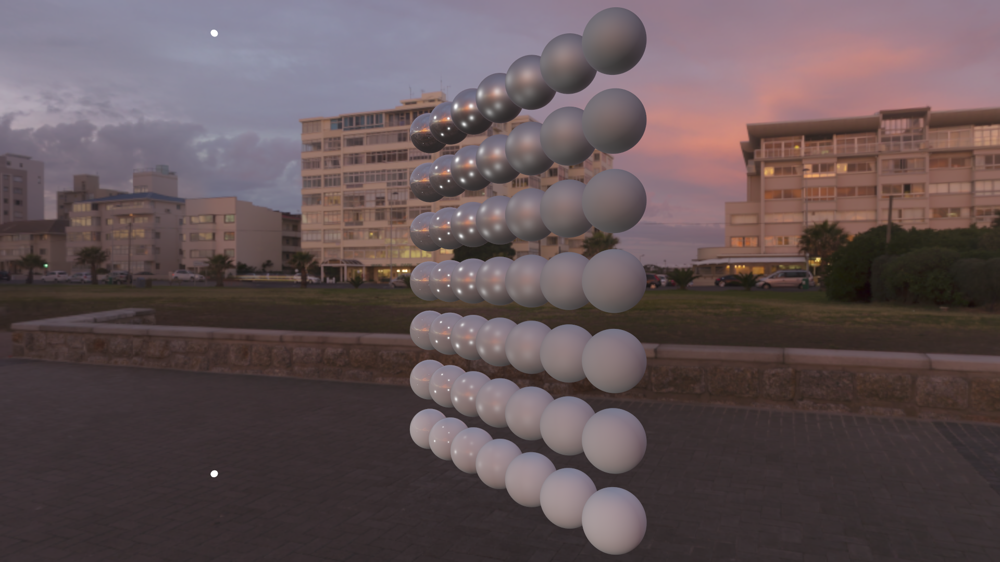
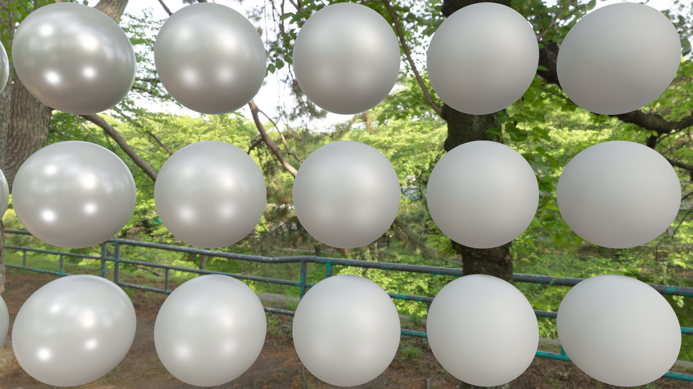
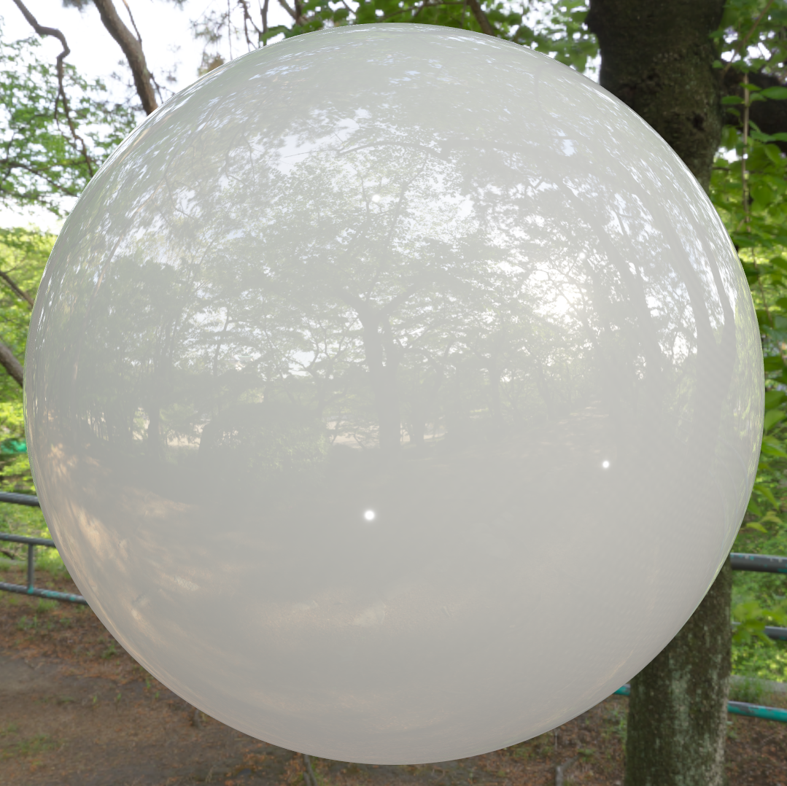
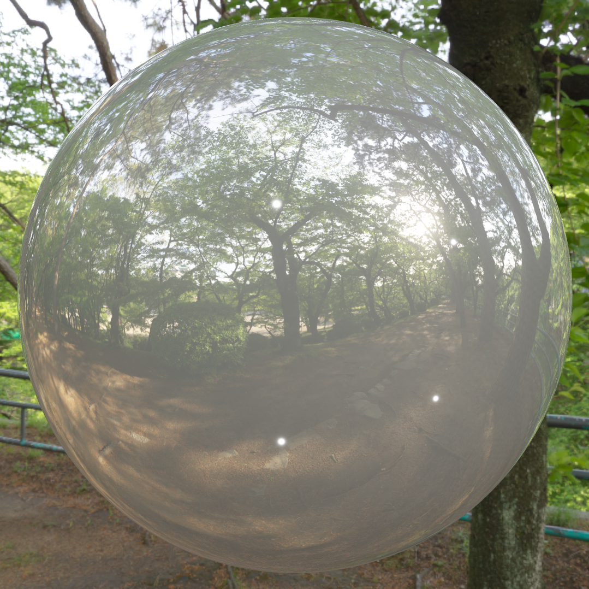
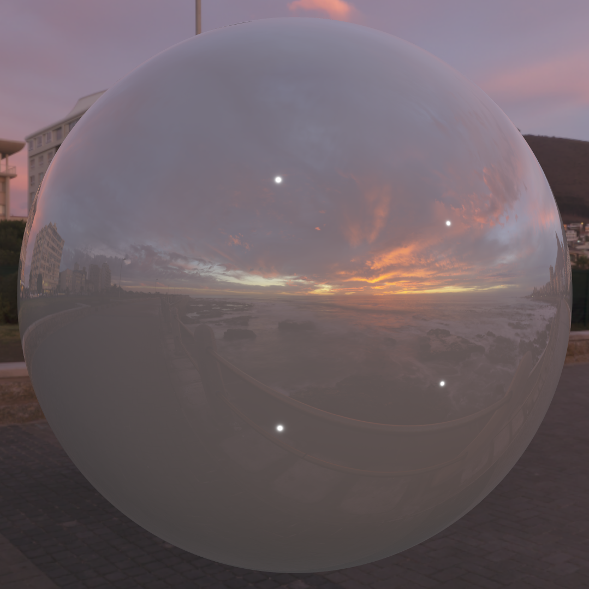
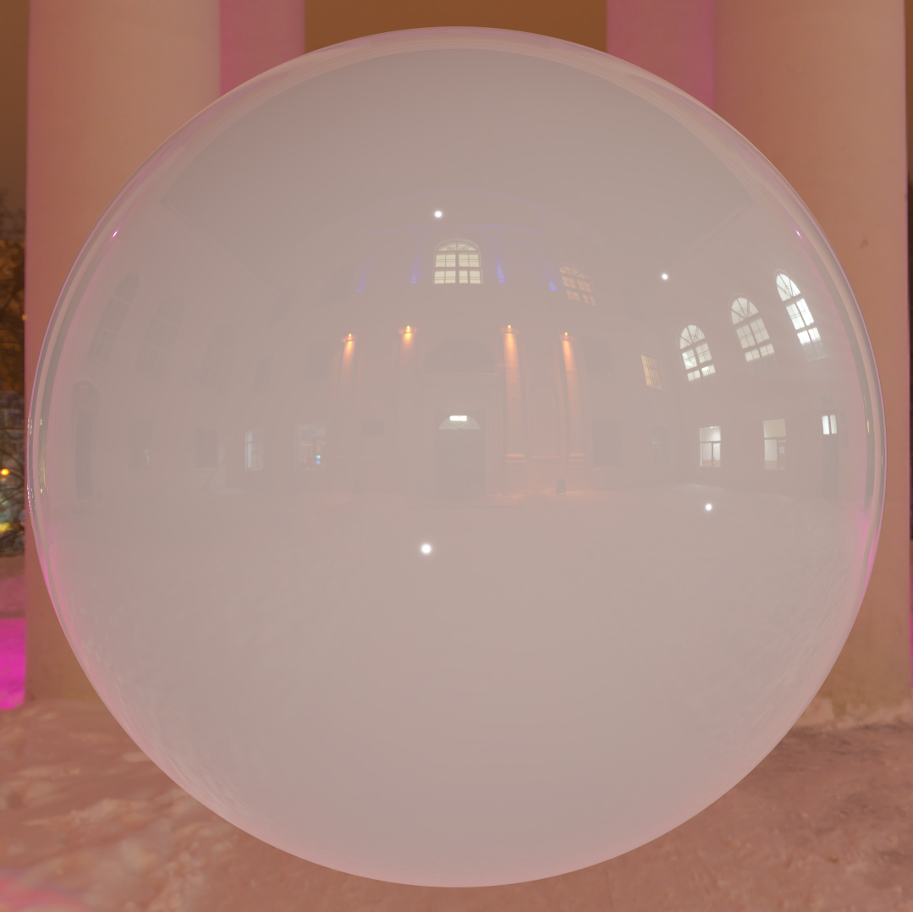

# Physically Based Rendering in OpenGL

My implementation of PBR using OpenGL

## About

The goal of this project was to learn the fundamentals of computer graphics, as my experience in the field was limited.
I started from the bottom, learning the very basics of computer graphics, and made my way up to the more advanced topics. 
I then built upon this knowledge to implement a Physically Based Renderer.

Using OpenGL as my graphics API of choice was a deliberate decision. The goal was not to learn a graphics API but to improve my 
computer graphics skills, and I felt OpenGL was well suited for that. I did not want to be distracted by the strict programming 
and usage rules of lower level graphics API. 

### Time

The PBR implementation from scratch took about 20 hours.
Before getting to the PBR implementation, understanding and implementing the basic and more advanced computer graphics topics took about 4-5 weeks. 

## Next Steps

Learn the Vulkan API through PBR implementation using Vulkan.

## Results

Below are some screenshots of my PBR implementation, using 6 different HDRI environments for Image Based Lighting and 4 points lights.
The non-textured spheres in the 7x7 grid layout increase in roughness when going right, and increase in metalness when going up.

### Colored Spheres
#### Overall

#### Overall, Left Side

#### Overall, Right Side

#### Closeup

#### Singles

### Textured Spheres
#### Overall

#### Overall, Left Side

#### Overall, Right Side

#### Closeup

#### Singles

